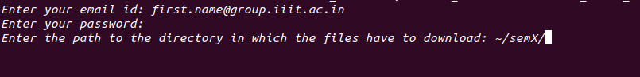
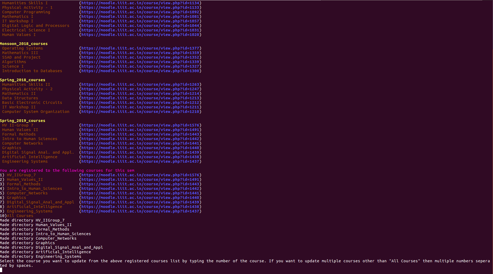

# moodle3it

This is a project which makes download of files from your courses in current semester hosted at https://moodle.iiit.ac.in simple with just a single command.

## How to install?

### Ubuntu
    sudo add-apt-repository ppa:sriteja777/terminal
    sudo apt-get update
    sudo apt-get install moodle3it

## How to use it?

Just type `moodle3it` in your terminal and press enter.
1.  Now you will be prompted for username, password and directory path for the files to download the respective courses.
    
2.  After entering your details it will login you and fetch all your courses upto current semester.
3.  Now you will choose for which courses you want to update, you will provided with a list of current semester courses. You can choose it by typing the number of course. 
    - For a single course, input the number of the course of course and press enter.
    - For all courses, input the number against All Courses and press enter.
    - For selected courses, let say 2 4 7 are the number of the courses you want to update, just enter the number of the course with spaces in between them and press enter Eg: `2 4 7`
    
4.  Now it will download files in given path.

#### Tired of typing email, password and path ever time?
Don't worry just copy the below lines and change details and you are set.
    
    export MOODLE_USERNAME="first.last@group.iiit.ac.in"
    export MOODLE_PASSWORD=******
    export MOODLE_FILES_PATH="~/path/to/download/"

## How to Contribute?

Contributions are always welcome! Just fork the repository into your account and make some interesting changes and send a pull request.

## How to report bugs?
For reporting bugs or if you have any issues, please raise an issue in the issues section of [this repository](https://github.com/sriteja777/moodle3it).

